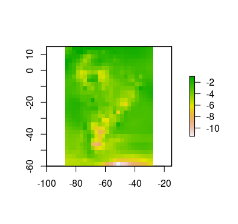
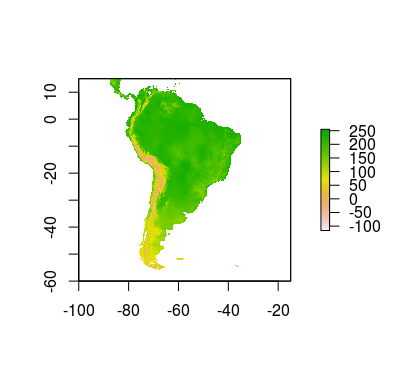
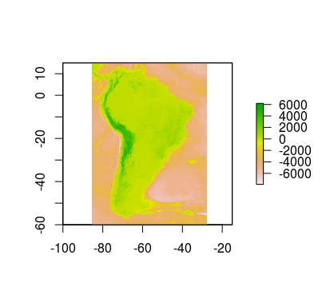
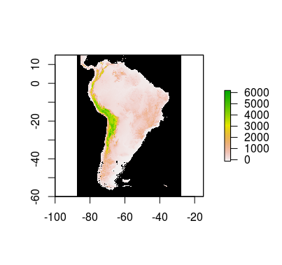
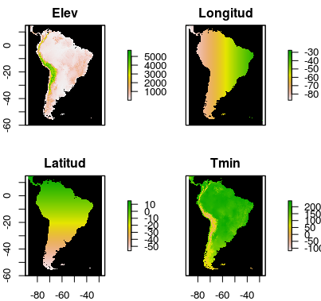
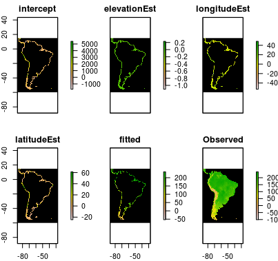
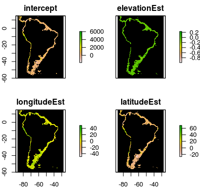
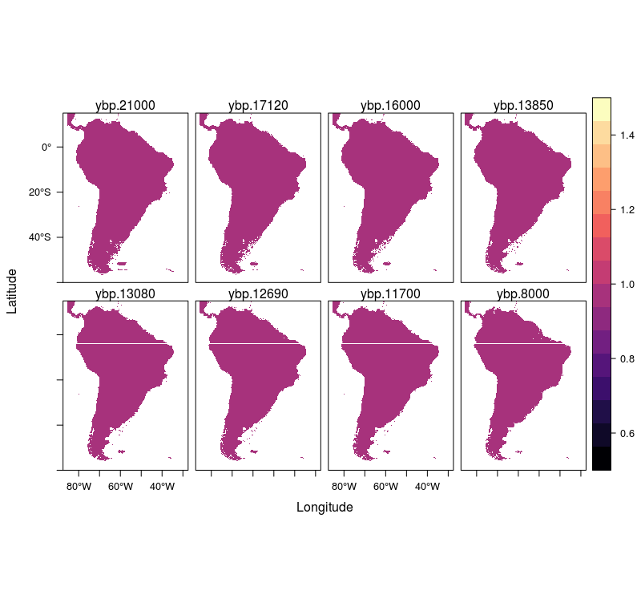
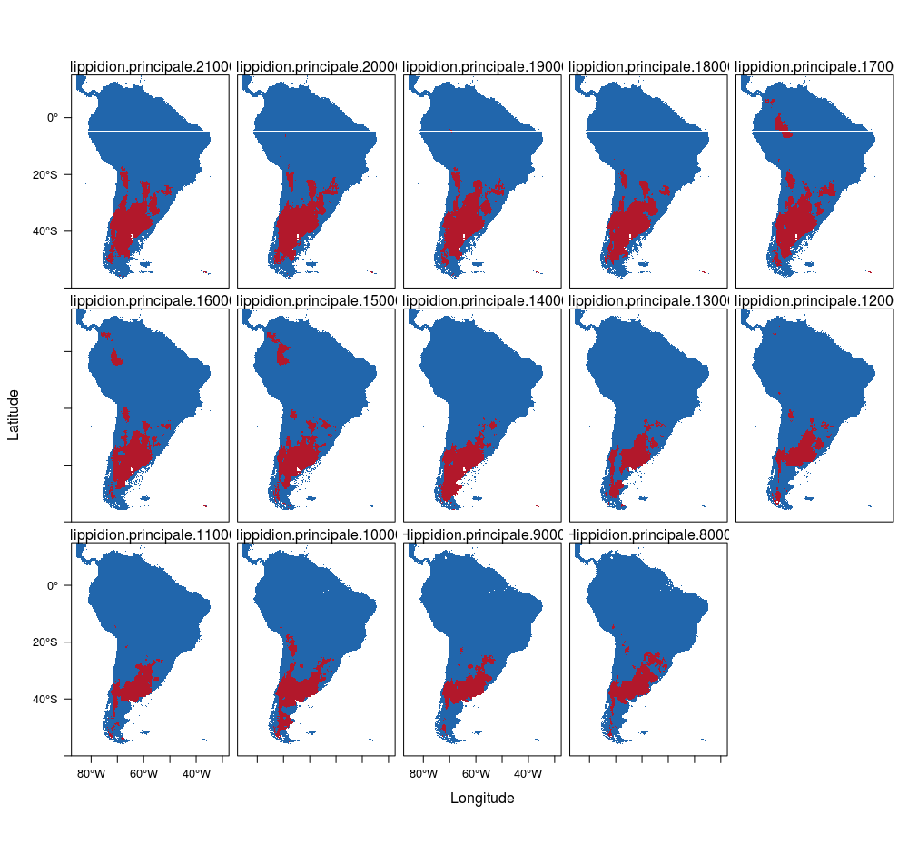

## Methods for downscaling 

This file explains how to go through all the scripts in order to get the results in the article named "Assessing the causes behind the Late Quaternary extinction of horses in South America using species distribution models." The following scripts are the ones used to generate the Downscaled layers and distribution models used in the manuscript.

### Files needed

* **Tmin, Tmax and pp files from Paleoview:** Using the [paleoView software](https://github.com/GlobalEcologyLab/PaleoView/releases), generate *ESRI ASCII* files for every decade encompasing your study, using the following options:
    + *Data :* Map Grid and Generate data files
    + *Time unit:* Month, you have to do every month
    + *Region:* Used defined, in our case for Southamerica we used 15 degrees north to 60 degrees south and longitudes 87.5 degrees west to 27.5 west
    + *Interval step:* 10 years (that is, layers are created for every decade, this could be changed according to your needs).
    + *Interval size:* 30 years (That is, the conditions are averaged over a period of 30 years)
    + *Generate change relative to:* Click on this and add 1975 AD (present day)

    
    
* **Worclim current conditions files:**  Files for tmin, tmax and precipitation [on the resolution you want](http://www.worldclim.org/current)

  

* **Bathymetry and altitude grid:** Extracted from the [GEBCO website](https://www.gebco.net/).

  

### Packages needed

The folowing packages were used to generate the database and model the species distribution:

* cmsdm (from https://github.com/cmerow)
* dismo
* maxnet
* pROC
* raster
* readxl
* rgdal
* Tidyverse
* trinaryMaps (from https://github.com/cmerow/trinaryMaps)

### Downscaling climatic data

#### Generation of Coefficients for temperature and precipitation

**GenerateCoeffs.r:** This sript takes the paleoView layers, the gebco bathymetry data, and current tmin, tmax and precipitation data to generate layers of cofficients that predict the current temperature, and precipitation considering the extended coastline of the last glacial maximum using the following steps:

1. Read the current climate datasets from Worldclim
2. Use the Paleoview layers to crop the prior layer to get the extent of the study site
3. Read the Gebco layer and use it to create a current elevation layer and a last glaciar maximum coastline layer

  

4. Generate a layer of latitude and a layer for logitude
5. Using a moving window (25*25) calculate the coefficients for temperature (min or max) or precipitation for each month explained by latitude + logitude + elevation with for the coastline in order to do that:
    + Use the 25 by 25 moving window to calculate the estimate for every square between 170 and 624 cells ensuring that this are only calculated for coastal areas
    + Use linear regression for temperatures (they can be either possitive or negative)
    + Use Poisson GLM for precipitation since the can only be possitive
    

6. Save those layers as *CoeficientesPrec.rds*, *CoeficientesTmax.rds* and *CoeficientesTmin.rds*

7. Extend the coefficients to the last glacial maximum by solving the laplace equation with 1000 iterations and save the Coefficients as *FullCoeficientesPrec.rds*, *FullCoeficientesTmax.rds* and *FullCoeficientesTmin.rds*

#### Generation of Layers for temperature and precipitation

**GenerateLayers.r:** This script takes the layers created in the steps above to create tmin, tmax and precipitation layers for any desirede year. The steps involved in this are as follows:

1. Generate a data.frame with all the years you want to generate layers for bioclimatic variables
2. Using those years, create another variable called Sealevel which will have the difference between current sealevel and the sea level of that year using the following info:
    + In the last glacial maximum the sealevel was 125 meters lower that today
    + From 21,000 till 17,000 sea level rises 0.06 meters a year
    + From 17,000 till present sea level rises 0.1 meters a year

|   YBP| SeaLevel|
|-----:|--------:|
| 21000|  -125.00|
| 20380|  -121.28|
| 20030|  -119.18|
| 20000|  -119.00|
| 19420|  -115.52|
| 19350|  -115.10|

3. Use that table and function to create Mask of the coastline as in the following example

4. Use the coefficients generated as *FullCoeficientesPrec.rds*, *FullCoeficientesTmax.rds* and *FullCoeficientesTmin.rds* to predict how the temperature would be in current conditions considering that years coastline
5. Use bilinear interpolation to create a delta layer of paloView files in the desired resolution
6. Add the downscaled delta layer to the generated current layer and save them in the *DownscaledLayers* Folder

#### Generation of bioclimatic layers

**GenerateLayers.r:** After generating the Tmin, Tmax and Prec layers for every month and every year use the *biovars* function in dismo to generate the 19 bioclimatic variables used in worclim for every desired year

### Species Distribution Models and projections

**SDMPerSpp.r:** This files uses a loop to separate a database by species, and then using the *maxent* package model the distribution of paleospecies. Following these steps

1. Generate a data.frame with the taxon name, the date, and the coordinates of the occurrence:

|taxon_name                   | age_average|       lng|       lat|
|:----------------------------|-----------:|---------:|---------:|
|Equus (Amerhippus) andium    |       13300| -73.13500| -40.57250|
|Equus (Amerhippus) insulatus |       13570| -64.76667| -21.55000|
|Equus (Amerhippus) neogeus   |       12670| -60.24417| -38.36056|
|Equus (Amerhippus) neogeus   |       12950| -60.24417| -38.36056|
|Equus (Amerhippus) neogeus   |       13080| -60.24417| -38.36056|
|Equus (Amerhippus) neogeus   |       13070| -60.24417| -38.36056|
|Equus (Amerhippus) neogeus   |       13200| -60.24417| -38.36056|
|Equus (Amerhippus) neogeus   |       13400| -60.24417| -38.36056|
|Equus (Amerhippus) neogeus   |       14000| -60.24417| -38.36056|
|Equus (Amerhippus) neogeus   |       19000| -60.38333| -37.33333|

2. Separate the data.frame into a list of data.frames were every table is the occurrence of a species
3. Read the biolcimatic layers of for the years of all the occurrences
4. For each species separate the presences by year
5. For each species in every year generate 1,000 background points
6. Extract the bioclimatic conditions for the backgrounds and the presences
7. Using *maxnet* generate the distribution models for every species using the *cloglog* response:
    + If there are more than 10 presences use a 5-fold crossvalidation
    + If there are less use a 3-fold crossvalidation
    + Use trinary map functions to get a TSS, hi, and low threshold with the crossvalidation
    + Project the models for every year
    + calculate the size of the distribution over the years
    

